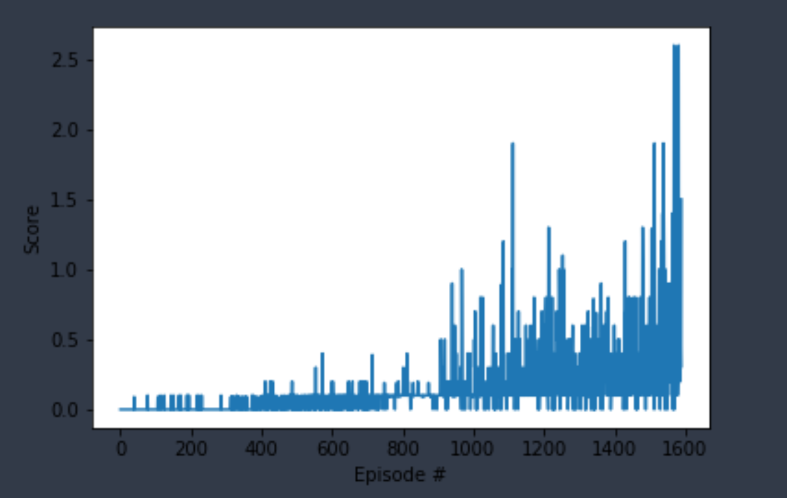

# Introduction
This report outines the implementation of a learning Agent to collaborate/compete in a game of Tennis. The game consists of two players (agents) that attempt to hit the ball over the net. An agent recieves a reward of +0.1 if it manages to hit the ball over the net and a reward of -0.01 if the agent lets the ball hit the ground or hits the ball out of bounds. The two agents aim to keep the ball in play to maximise their score.

The problem is episodic with an eposide ending when either the ball hits the ground or is hit out of bounds.

The Environment is solved when over 100 episodes the average score is 0.5 or greater where the score is the maximum of the two agents for an episode.

# Description of the Learning Algorithm
The Agent uses an implementation of the Multi-Agent Deep Determistic Policy Gradient algorithm ([MADDPG](https://arxiv.org/pdf/1706.02275.pdf)) using the code provided in [Udacity Deep Reinforcement Learning - ddpg-pendulum](https://github.com/udacity/deep-reinforcement-learning/tree/master/ddpg-pendulum) as a basis for the implemented Agent.

This MADDPG has 2 agents (one for each player) and each of these agents are DDPG (Deep Deterministic Policy Gradient) Agents which use seperate Actor and a Critic networks 
 - the Actor attempts to learn the Policy to decide on the action to take based on the current environment state
 - the Critic attempts to learn Value function to estimate value of the action taken 

In this implementation, both player agents share the same Experience Replay buffer rather than, in the case of DDPG, having it's own. This buffer contains the observations for both player agents.

Both the Actor and Critic networks have a local and target network; during learning the local network is updated and after a period of time the target network is updated using a soft update.

The Algorithm implemented had the following configuration:

**Actor**
- 2 Hidden layers with 256 and 128 units using a RELU activation
- Tanh activation function on output
- Local and Target networks initalised to the same weights before training
- Soft update of local and target network waits using Tau = 1e-2

**Critic**
- 2 Hidden layers with 256 and 128 units using a RELU activation
- Batch Normalization on the first hidden layer
- Local and Target networks initalised to the same weights before training
- Soft update of local and target network waits using Tau = 1e-2

**MADDPG Algorithm**
- Delays the start of learning until a period of exploration (300 episodes) was complete 
- Had a Single learning epochs per step (learned 1 times for each step)
- Shares additional state information with the Player Agent Critic networks; this was the state and actions for the other Player Agents
- Uses a Future Reward discount (Gamma) of 0.99

## Plot of Rewards
The Agent was used to train the player agents to achieve an average score of 0.5 over 100 episodes.

The Agent was able to solve the environment within 1589 episodes.

**Note** some inconsistences were found during multiple runs of the Agent learning with the solution to the environment being reached at points in the range 1,500 to 2,100. This may be due to the random seed initialisation within the Unity Agent.

The following plot shows the plot of rewards during the training:

The plot shows a period during training where the rewards were relatively low (see period between 300 and 900 episodes). This is followed by a period of increasing rewards as the Agents begin to collaborate towards the goal. There is still a reasonable level of variation in the episode scores and observing the play of the trained agent it can be seen that sometimes the agents settle into a repeating pattern of play (wich results in a high score) but sometimes the Agents make mistakes quite early in the episode that results in low scores.

Increasing the length of the training and setting a higher Goal Score might lead to more consistent play.

# Hyperparameter tuning experiments
The baseline Agent used a set of _informed guesses_ for the hyperparameters and were in part informed by various discussions on the course's Slack Channel; in particular the values for Tau and Noise Scale were selected based on various thread disucssion in the Slack Channel. 

The baseline Agent Configuration was as follows:
|Hyperparameter| Value|
|---|---|
|Hidden Layer Size| 256 -> 128|
|Learning Rates|Actor LR: 1e-3 Critic LR:1e-4|
|Tau (for local to target soft updates)|1e-2|
|Learning Batch Size|256|
|Replay Buffer Size|1e6|
|Noise scheme|OU Noise Generator with constant noise scale of 0.5|
|Learning scheme|Start learning after 300 episodes, learn once per step|

To better understand the effect of the different hyperparameters and learning/noise schemes on this implementation a set of Experiments were performed.

Using the Baseline as a starting point, each experiment altered 1 hyperparameter and observed the difference in learning. 

The detailed results of these can be found in [Tennis.html](./tennis.html) along with a brief rationale for each of the experiments.

The following table summaries the outcomes for the experiments:

|Hyperparameter Experiment| value|Episodes to reach goal|
|---|---|---|
|Larger Hidden Layer Network Size| 512 -> 256| 1823|
|Smaller Noise Scale|0.25|2012|
|Decay Noise|Decay Noise after 1500 episodes for 500 episodes|1842|
|Adaptive Noise Decay|Adapt noise based on closeness to goal score between 0.05 and 0.5|2502|
|Smaller Tau|5e-3|2609|
|Smaller Learning Rates|Actor LR: 5e-4 Critic LR:5e-5|1869|
|Larger Learning Rates|Actor LR: 5e-3 Critic LR:5e-4|Failed to reach goal within 3000 episodes|
|Smaller Replay Buffer Size|1e4|1623|
|Smaller Learning Batch|128|2072|
|Larger Learning Batch|512|2364|
|Agent with multiple learning batches per step|2 learning batches per step|1950|
|Agent Learns less often| Learn every other step|1272|

## Conclusions of Experiments
The aim of the experiements was to understand how learning is effected by the different hyperparameters with respect to the number of episodes required to train the Agents.

With the exception of learning less often (every other step rather than every step), it was found that the experiments performed worse than the baseline (in terms of number of episodes to reach the goal score).

The experiment to learn less often resulted in a reduction of the number of steps from approx. 1,600 steps to approx.  1,300 steps.

A number of the experiments reached the goal score in less than 2,000 episodes (compared to 1589 on the baseline) with a small number of either exceeding this or, in the case of the larger Learning Rates, failed to reach the goal.

**Note**
However, as stated earlier in the report some of the variations may be as a result of the variations observed when running the baseline multiple times. Time constraints meant that, at the moment, it was not possible to run these experiments multiple times. Therefore these results should be considered indicative rather than absolute.

# Comparison of Untrained vs Trained Agents
The following animation shows an example of the untrained agent following a random policy.

The following animation shows an example of the Trained Agent (baseline configuration).

# Ideas for Future Work
Additional avenues for exploration include:
## Using Prioritised Experience Replay
The plot of rewards indicates quite a long period of relatively low rewards followed by a shorter period of much higher rewards leading to the goal (average score >0.5 over 100 episodes). Observing play of a partially trained (during the low reward period) indicated that while there were some good rallies most of the time the rallies were short. Longer rallies have higher rewards and it would seem beneficial to learn more from these than from those with much lower rewards. However with a pure random sampling this is not always the case.

To improve the learning, the introduction of a Prioritised Experience Replay Buffer may allow the Agent to learn quicker as higher reward experiences have a higher chance of being selected for learning.

## Experimenting with Additional State information
The current implementation provides the Critic networks with additional state information, namely the information about the other agent's state and actions. Currently this information is provided as is from the Unity Environment. However, this data incldues some repetition which may bias the learning.

Experiments could be undertaken to reduce the level of duplication in this additional state data and to provide additional data that is derived from the experiences that condenses the essential additional state information into a smaller data se

These actions may reduce the compuation time and focus the learning of the agent. 

## Using a Shared Critic
The current implementation is using seperate critics for the two agents; each of these critics is being provided with similar information and so some of the learning may be duplicated.

Given this is a collaboration task, having a shared Critic across the Agents may lead to quicker learning around collaborative actions; this will also reduce the amount of compuation needed.
